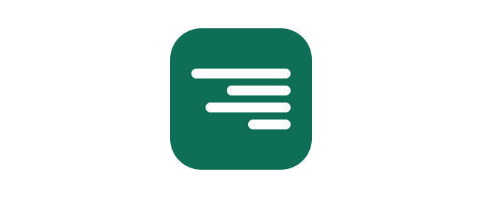

<div align="center">

<!-- Install Button -->
<a href="https://chromewebstore.google.com/detail/fluent-arabic-web/gofhnecgeianjadhjmlkpmfjmflmolag" target="_blank">
  
  <br>
  
</a>

<br><br>

---



<h1>Fluent Arabic Web</h1>

<p><b>تجربة تصفح عربية مثالية — بدون تحريك أو كسر التخطيط</b></p>


</div>

---

## 📖 عن الإضافة

إضافة **Fluent Arabic Web** تهدف إلى تحسين عرض النصوص العربية على مواقع الويب التي لا تدعم اللغة العربية بشكل كامل أو لا توفر اتجاه النص من اليمين إلى اليسار (RTL) بشكل صحيح. تقوم الإضافة باكتشاف النصوص العربية تلقائياً وتصحيح اتجاهها دون إحداث فوضى في تخطيط الموقع الأصلي.

---

## 🧭 كيف تعمل الإضافة؟



*يساراً: نص عربي غير منسق (محاذاة خاطئة وترتيب كلمات معكوس) — يميناً: نفس الصفحة بعد أن تصحح الإضافة الاتجاه والمحاذاة تلقائياً، دون المساس بتصميم الموقع.*

---

## ✨ المميزات الرئيسية

| الميزة | الوصف |
|---|---|
| 🔍 **اكتشاف تلقائي وذكي** | تكتشف النصوص العربية في الصفحة وتصحح اتجاهها إلى اليمين (RTL) |
| 🔤 **إصلاح Bidi** | معالجة متقدمة لثنائية الاتجاه لتجنب عكس الكلمات الأجنبية والأرقام |
| 🛡️ **حماية التخطيط** | تعديل النصوص فقط مع الحفاظ على التصميم العام للموقع |
| 🌑 **Shadow DOM** | دعم كامل للمواقع الحديثة التي تستخدم Shadow DOM |
| 🖋️ **خطوط مخصصة** | خطوط عربية جميلة من ثمانية تايبفيس لأفضل تجربة قراءة |
| 🌐 **دعم iFrames** | تطبيق RTL داخل الإطارات المضمّنة (`all_frames: true`) |
| ⭐ **Whitelist / Blacklist** | دعم `*.example.com` لإدارة المواقع بمرونة |
| ⌨️ **اختصار لوحة المفاتيح** | تفعيل/تعطيل RTL بضغطة `Alt + Shift + A` |

---

## 🖼️ صور الإضافة

### قبل الاستخدام


### بعد الاستخدام


### واجهة الإضافة


---

## 🚀 التثبيت

### من Chrome Web Store (موصى به)

<a href="https://chromewebstore.google.com/detail/fluent-arabic-web/gofhnecgeianjadhjmlkpmfjmflmolag">
  
</a>

### من المصدر (للمطورين)

```bash
git clone https://github.com/SMSMy/Fluent-Arabic-Web.git
```

1. افتح `chrome://extensions/` أو `edge://extensions/`
2. فعّل **وضع المطور (Developer mode)**
3. انقر **تحميل إضافة فُكّ ضغطها (Load unpacked)**
4. اختر مجلد المستودع

---

## 🚧 التطوير وخارطة الطريق

### مواقع معروفة لا تعمل معها الإضافة بعد

بعض التطبيقات الحديثة (SPA) لا يكفيها الكشف العام، ومنها:

- [grok.com](https://grok.com/) و [aistudio.google.com](https://aistudio.google.com/) — React/Angular يعيدان رسم الصفحة باستمرار فيُمحى `dir="rtl"` بعد أول re-render
- صفحات DeepSeek Harness المحلية (`127.0.0.1:3080`)

| السبب | الأثر |
|---|---|
| لا يوجد profile للموقع في `lib/site-profiles.js` | يعمل الكشف العام فقط وينكسر مع المواقع الديناميكية |
| React / Tailwind يعيدان الرسم | `dir="rtl"` يُمسَح فوراً |
| البث الحي للتوكنات | وميض بين LTR و RTL |
| Shadow DOM / CSP | العناصر الداخلية لا تُلمَس |

### الإنجازات المكتملة

1. ✅ **Profiles جاهزة داخل الكود** — أُضيفت profiles لـ **Grok** (`grok.com` / `grok.x.ai`) و**Google AI Studio** (`aistudio.google.com`) و**Microsoft Copilot** و**Discord** و**Notion** و**DeepSeek Harness** (`127.0.0.1:3080`)، بنفس أسلوب ChatGPT وClaude: CSS بـ `!important` و`unicode-bidi: plaintext` (يصمد أمام re-render)، مع استثناء `pre` و`code` و`katex` حتى لا ينعكس الكود.
2. ✅ **محرر عناصر لكل موقع** — زر «🎯 التقاط عنصر» (element picker) في الـ popup يحفظ selectors مستقرة (تفضيل `data-testid` ثم `id` ثم `aria-label` ثم مراسٍ قريبة) في `chrome.storage` تحت `perSite[hostname].selectors`، مع إضافة يدوية وثلاثة أوضاع: تلقائي / فرض RTL / استثناء LTR.
3. ✅ **وضع «طبيب الموقع»** — زر «🔍 طبيب الموقع» يشخّص سبب نجاح/فشل الإضافة: نسبة العربية مقابل العتبة، وجود profile، عدد العناصر المعالجة، وفحص نبض الـ MAIN world patch (يكشف حجب CSP).
4. ✅ **debounce ديناميكي** — 100ms لمواقع البث الحي (`streaming: true`)، 300ms للصفحات الثابتة.
5. ✅ **إصلاحات تقرير الفحص** — تجميع دفعات الـ `MutationObserver`، إزالة تسريب `return true`، نسخ آمن في `loadSettings`، كاش لنتائج `getComputedStyle`، تنظيف CSS المكرر، وتوليد أيقونات PNG معتمة جديدة.
6. ✅ **الخطوط WOFF2** — حُوّلت كل خطوط OTF الست عشرة (المصمك، النسيب، الوتد، عام الشعر، الحرف اليدوية، عام الجمل) إلى WOFF2 (توفير 27–71% من الحجم).
7. ✅ **اختبارات آلية** — `npm test` يشغّل 30 اختباراً على صفحات ثابتة (fixtures شبيهة بقروك) تغطي الكاشف والـ profiles ومعالجة Bidi ومحددات perSite.
8. ✅ **إصلاح القوائم والمحرر (جولة الفحص البصري)** — `ul`/`ol` تُقلب الآن إلى RTL ديناميكياً حسب محتواها العربي (النقاط والأرقام تظهر على اليمين حتى داخل القوائم المتداخلة)، ومحرر DeepSeek Harness يُعالج عبر طبقة النص المرئية الحقيقية `[data-input-backdrop]` — لأن نص الـ textarea في DSH شفاف ويُعرض عبر طبقة mirror/backdrop. تم التحقق من كل ذلك في متصفح حقيقي على نسخة طبق الأصل من بنية DSH (`tests/dsh-replica.html`).
9. ✅ **مقاومة التطبيقات الديناميكية (AI Studio الفئة)** — التطبيقات مثل Google AI Studio تعيد كتابة `dir` وتمسح الأنماط بعد التثبيت (لهذا «يعود» النص لمدة ثانية ثم ينتكس): أصبحت الإضافة تراقب تغييرات `dir`/`style` على عناصرها وتفرض قيمتها من جديد، وتعيد حقن أنماط الـ profile تلقائياً إذا حذفها التطبيق، مع شبكة أمان CSS عامة (`main p, li, blockquote`) لا تعتمد على أسماء مكونات Angular القابلة للتغير، وتمريرة توفيق بعد 2.5 ثانية من التفعيل.

### قيد التطوير

1. **تحديث الـ profiles عن بُعد** — ملف JSON على GitHub تتحمّله الإضافة تلقائياً، بدل انتظار تحديث المتجر عند كل تغيير في كلاسات المواقع.
2. **التحقق الحي من المحددات** — كلاسات Grok/Copilot/Discord/Notion مبنية على مصادر مؤكدة من إضافات حقيقية، لكنها تحتاج تأكيداً عملياً على المواقع الحية بعد كل تحديث واجهة (استخدم «طبيب الموقع» و«التقاط عنصر» عند الكسر).

### ما لا ننصح به

- كتابة CSS selectors يدوياً بدون element picker
- `forceRTL` على كامل `body` في قروك — يكسر الشريط الجانبي والكود
- الاعتماد على `loadDelay` طويل وحده — يعالج التحميل الأول فقط وليس البث الحي
