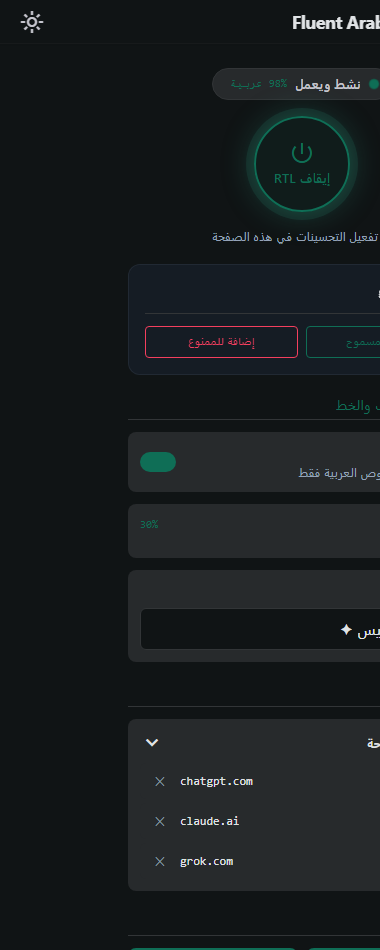

<div align="center">

<a href="https://chromewebstore.google.com/detail/fluent-arabic-web/gofhnecgeianjadhjmlkpmfjmflmolag">
  
</a>

<br>

<a href="https://chromewebstore.google.com/detail/fluent-arabic-web/gofhnecgeianjadhjmlkpmfjmflmolag">
  
</a>


# Fluent Arabic Web

**تجربة تصفح عربية مثالية — بدون كسر تخطيط الصفحة**

Perfect Arabic browsing — RTL correction that leaves the layout alone.

<br>


</div>

---

<div dir="rtl" lang="ar">

## لماذا هذه الإضافة؟

مواقع كثيرة تعرض العربية مقلوبة أو محاذاة لليسار: الكلمات تتفكك، الأرقام تقفز، والكود ينعكس مع النص. الإضافات التي تقلب الصفحة كلها بـ `direction: rtl` على `body` تُصلح سطراً وتكسر الشريط الجانبي وزر الإرسال وكتل الكود.

**Fluent Arabic Web** تكتشف النص العربي داخل الصفحة وتصحّح اتجاهه فقط. التخطيط يبقى كما صمّمه الموقع.


*يساراً: عربي غير منسّق — يميناً: نفس الصفحة بعد التصحيح، دون المساس بالتصميم.*

## المميزات

|                        |                                                                                  |
| ---------------------- | -------------------------------------------------------------------------------- |
| **اكتشاف تلقائي**      | تُفعَّل حين تبلغ نسبة العربية عتبة تضبطها أنت (افتراضي 15٪)                      |
| **إصلاح Bidi**         | العربية يمين، والإنجليزية والأرقام والكود تبقى على حالها داخل نفس الفقرة         |
| **حماية التخطيط**      | لا قلب لـ flex/grid ولا لشريط الأدوات                                            |
| **ملفات مواقع جاهزة**  | ChatGPT وClaude وGrok وAI Studio وHarness وغيرها — CSS يصمد أمام إعادة رسم React |
| **التقاط عنصر**        | اضغط على النص المعوج في الصفحة؛ الإضافة تحفظ محدداً مستقراً لهذا الموقع          |
| **طبيب الموقع**        | يخبرك لماذا لم تُصحَّح الصفحة: عتبة، غياب profile، أو حجب السكربت                |
| **Shadow DOM وiframe** | تعمل داخل المكوّنات الحديثة والإطارات المضمّنة                                   |
| **خطوط عربية**         | تسعة خطوط، منها ثمانية تايبفيس وخطوط عام الشعر والجمل والحرف                     |
| **قوائم مرنة**         | سماح أو تجاهل بنطاق مثل `*.example.com`                                          |
| **اختصار**             | `Alt` + `Shift` + `A` لتفعيل أو إيقاف الصفحة الحالية                             |

## لقطات

| قبل | بعد |
| --- | --- |
|  |  |

<p align="center">
  
  <br>
  <em>النافذة المنبثقة — تفعيل، خط، قوائم، التقاط عنصر، وطبيب الموقع</em>
</p>

## الاستخدام

1. ثبّت الإضافة وافتح أي صفحة فيها عربي.
2. إن كان التعرف التلقائي مفعّلاً تُصحَّح الصفحة وحدها. وإلا اضغط أيقونة الإضافة ثم **تفعيل RTL**، أو `Alt` + `Shift` + `A`.
3. من بطاقة الموقع الحالي: **مسموح** (دائماً) أو **ممنوع** (تجاهل هذا النطاق).
4. اختر الخط وحساسية التعرف إن لزم.
5. إذا بقي سطر معوجاً في موقع ديناميكي: **التقاط عنصر** ثم انقر النص. يُحفظ الإعداد لهذا الموقع فقط.
6. إذا لم يحدث شيء: **طبيب الموقع** يعرض السبب (نسبة العربي، وجود ملف موقع، عدد العناصر، وحالة الرقعة الداخلية).

ثلاثة أوضاع للمحدد المخصّص: **تلقائي** (حسب المحتوى) · **فرض RTL** · **استثناء LTR** (للكود والمعادلات).

## مواقع لها ملف جاهز

هذه المواقع لا يكفي معها الكشف العام (تعيد رسم الصفحة أو تبث النص حياً). لها قواعد مخصّصة، مع إبقاء `pre` و`code` وKaTeX باتجاه LTR.

**محادثات ووكلاء**

| الموقع            | النطاق                                            |
| ----------------- | ------------------------------------------------- |
| Grok              | `grok.com` · `grok.x.ai`                          |
| Google AI Studio  | `aistudio.google.com`                             |
| ChatGPT           | `chatgpt.com`                                     |
| Claude            | `claude.ai`                                       |
| Gemini            | `gemini.google.com`                               |
| Microsoft Copilot | `copilot.microsoft.com`                           |
| Perplexity        | `perplexity.ai`                                   |
| NotebookLM        | `notebooklm.google.com`                           |
| DeepSeek Harness  | `127.0.0.1` · `localhost` (المنفذ 3080 افتراضياً) |

**تواصل وعمل**

| الموقع       | النطاق             |
| ------------ | ------------------ |
| Slack        | `app.slack.com`    |
| Discord      | `discord.com`      |
| WhatsApp Web | `web.whatsapp.com` |
| Notion       | `notion.so`        |

**ويب عام**

YouTube · X · Facebook · Google · Gmail · Reddit · LinkedIn · GitHub

> قواعد Harness مقيّدة بسمات مثل `data-composer-card` حتى لا تُمسّ تطبيقات localhost الأخرى.

أي موقع آخر يعمل بالكشف العام. إن كسر تحديث الواجهة ملفاً جاهزاً: التقط العنصر أو راجع طبيب الموقع — لا حاجة لكتابة CSS يدوياً.

## التثبيت

### من المتجر (موصى به)

<a href="https://chromewebstore.google.com/detail/fluent-arabic-web/gofhnecgeianjadhjmlkpmfjmflmolag">
  
</a>

تعمل على **Chrome** و**Edge** (وأي متصفح مبني على Chromium يدعم إضافات Chrome).

### من المصدر

```bash
git clone https://github.com/SMSMy/Fluent-Arabic-Web.git
```

1. افتح `chrome://extensions/` أو `edge://extensions/`
2. فعّل **وضع المطوّر**
3. **تحميل إضافة فُكّ ضغطها** → مجلد المستودع

## الخطوط

تُحقن اختيارياً على النصوص العربية فقط، لا على واجهة الموقع.

| الخط                                      | المصدر                |
| ----------------------------------------- | --------------------- |
| ثمانية تايبفيس                            | الافتراضي             |
| المصمك · النسيب · الوتد · الأول · السعودي | خطوط الهوية السعودية  |
| عام الشعر · عام الجمل · الحرف اليدوية     | خطوط الأعوام الثقافية |
| افتراضي النظام                            | بدون حقن              |

## الخصوصية

- لا حسابات، لا تتبّع، لا خادم خارجي.
- الإعدادات تُحفظ في `chrome.storage` على جهازك (مع مزامنة المتصفح إن فعّلتها).
- الإضافة تحتاج صلاحية الصفحات لتصحيح النص داخلها، ولا ترسل محتوى الصفحات إلى أي جهة.
- تصدير/استيراد الإعدادات ملف JSON محلي أنت من يحفظه.

## ما الجديد في 4.2

- ملفات جاهزة لـ Grok وAI Studio وCopilot وDiscord وNotion وDeepSeek Harness
- التقاط عنصر وطبيب الموقع من النافذة المنبثقة
- مقاومة المواقع التي تمسح `dir` بعد الرسم (AI Studio وأشباهها)
- تصحيح القوائم المتداخلة حسب المحتوى العربي
- خطوط WOFF2 أخف، ومظهر فاتح/داكن للنافذة
- اختبارات آلية على صفحات ثابتة (`npm test`)

**التالي:** تحديث ملفات المواقع عن بُعد حتى لا تنتظر مراجعة المتجر عند تغيّر كلاسات موقع.

## للمطوّرين

```bash
npm test           # كاشف Bidi، الملفات الجاهزة، المحددات، النافذة
npm run build:popup
```

| الملف                         | الدور                              |
| ----------------------------- | ---------------------------------- |
| `content.js`                  | التفعيل، المراقب، الإعدادات        |
| `lib/detector.js`             | نسبة العربية                       |
| `lib/bidi-fix.js`             | اتجاه الفقرة دون قلب التخطيط       |
| `lib/site-profiles.js`        | قواعد المواقع الجاهزة              |
| `lib/shadow-dom-traverser.js` | Shadow DOM                         |
| `shadow-patch.js`             | رقعة `attachShadow` في عالم الصفحة |
| `popup/`                      | الواجهة (Tailwind محلي)            |

لا تقلب `body` بـ `direction: rtl` في ملف موقع. لا تعتمد على `loadDelay` وحده للبث الحي. فضّل `data-testid` و`aria-label` على كلاسات Tailwind.

## الأسئلة الشائعة

**الصفحة لم تتغيّر.**  
افتح طبيب الموقع. إن كانت نسبة العربي تحت العتبة خفّف الحساسية، أو أضف النطاق للمسموح، أو التقط العنصر.

**الكود انعكس.**  
أضف المحدد في وضع **استثناء LTR**، أو تأكد أن الملف الجاهز يستثني `pre`/`code`. لا تستخدم فرض RTL على الصفحة كلها.

**قروك / AI Studio / Harness.**  
لها ملفات جاهزة في 4.2. إن كسر تحديث الواجهة شيئاً: التقاط عنصر على الصندوق أو فقرة الرد.

**localhost.**  
Harness يُطابق `127.0.0.1` و`localhost`. القواعد لا تُطبَّق إلا بوجود سمات الواجهة الخاصة به.

## المساهمة

التقاطات عناصر مستقرة، إصلاح ملف موقع مكسور، أو اختبار على واجهة تغيّرت — كلها مرحّب بها عبر Issues وPull Requests.

## الرخصة

[MIT](LICENSE)

</div>

---

<div dir="ltr" lang="en">

## English

**Fluent Arabic Web** is a Manifest V3 extension that detects Arabic on a page and fixes its direction **without flipping the layout**. Sidebars, composers, and code blocks stay intact. English, numbers, and `pre`/`code`/KaTeX remain LTR inside mixed paragraphs.

**Install:** [Chrome Web Store](https://chromewebstore.google.com/detail/fluent-arabic-web/gofhnecgeianjadhjmlkpmfjmflmolag) · Chrome and Edge.

**Use:** auto-detect (adjustable threshold) or `Alt+Shift+A`. Per-site allow/deny lists (`*.example.com`). **Pick an element** to save a stable selector. **Site doctor** explains misses (Arabic ratio, missing profile, CSP). Optional Arabic fonts. Settings stay in `chrome.storage` — no accounts, no telemetry, no page content leaves the machine.

**Built-in profiles** (CSS that survives React re-renders, code excluded): Grok, Google AI Studio, ChatGPT, Claude, Gemini, Copilot, Perplexity, NotebookLM, DeepSeek Harness (`localhost` / `127.0.0.1:3080`), Slack, Discord, WhatsApp Web, Notion, plus YouTube, X, Facebook, Google, Gmail, Reddit, LinkedIn, GitHub.

**Dev:** `npm test` · `npm run build:popup` · MIT.

</div>
